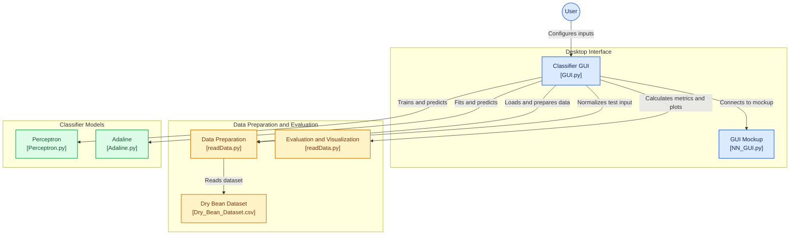

# Neural Networks & Deep Learning

## Single-Layer Perceptron and Adaline Workflow

```mermaid id="n6v3qa"
flowchart TD
    subgraph group_interface["Desktop Interface"]
        node_gui["Classifier GUI<br/>[GUI.py]"]
        node_mockup["GUI Mockup<br/>[NN_GUI.py]"]
    end

    subgraph group_data["Data Preparation and Evaluation"]
        node_dataset["Dry Bean Dataset<br/>[Dry_Bean_Dataset.csv]"]
        node_data_prep["Data Preparation<br/>[readData.py]"]
        node_evaluation["Evaluation and Visualization<br/>[readData.py]"]
    end

    subgraph group_models["Classifier Models"]
        node_perceptron["Perceptron<br/>[Perceptron.py]"]
        node_adaline["Adaline<br/>[Adaline.py]"]
    end

    node_user(("User"))

    node_user -->|"Configures inputs"| node_gui
    node_gui -->|"Loads and prepares data"| node_data_prep
    node_data_prep -->|"Reads dataset"| node_dataset
    node_gui -->|"Trains and predicts"| node_perceptron
    node_gui -->|"Fits and predicts"| node_adaline
    node_gui -->|"Calculates metrics and plots"| node_evaluation
    node_gui -->|"Normalizes test input"| node_data_prep
    node_gui -->|"Connects to mockup"| node_mockup

    click node_gui "https://github.com/yassakamille/single_layer_perceptron_and_adaline/blob/main/GUI.py"
    click node_mockup "https://github.com/yassakamille/single_layer_perceptron_and_adaline/blob/main/NN_GUI.py"
    click node_dataset "https://github.com/yassakamille/single_layer_perceptron_and_adaline/blob/main/Dry_Bean_Dataset.csv"
    click node_data_prep "https://github.com/yassakamille/single_layer_perceptron_and_adaline/blob/main/readData.py"
    click node_evaluation "https://github.com/yassakamille/single_layer_perceptron_and_adaline/blob/main/readData.py"
    click node_perceptron "https://github.com/yassakamille/single_layer_perceptron_and_adaline/blob/main/Perceptron.py"
    click node_adaline "https://github.com/yassakamille/single_layer_perceptron_and_adaline/blob/main/Adaline.py"

    classDef toneNeutral fill:#f8fafc,stroke:#334155,stroke-width:1.5px,color:#0f172a
    classDef toneBlue fill:#dbeafe,stroke:#2563eb,stroke-width:1.5px,color:#172554
    classDef toneAmber fill:#fef3c7,stroke:#d97706,stroke-width:1.5px,color:#78350f
    classDef toneMint fill:#dcfce7,stroke:#16a34a,stroke-width:1.5px,color:#14532d
    classDef toneRose fill:#ffe4e6,stroke:#e11d48,stroke-width:1.5px,color:#881337
    classDef toneIndigo fill:#e0e7ff,stroke:#4f46e5,stroke-width:1.5px,color:#312e81
    classDef toneTeal fill:#ccfbf1,stroke:#0f766e,stroke-width:1.5px,color:#134e4a

    class node_gui,node_mockup,node_user toneBlue
    class node_dataset,node_data_prep,node_evaluation toneAmber
    class node_perceptron,node_adaline toneMint
```

